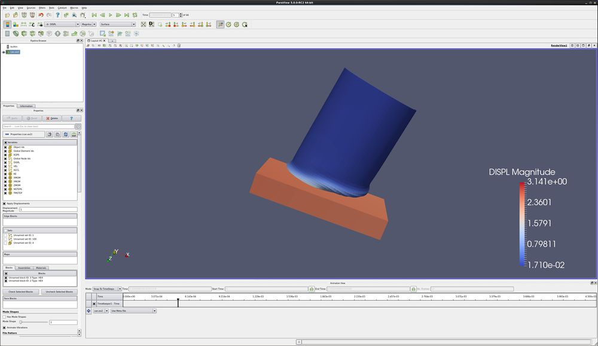
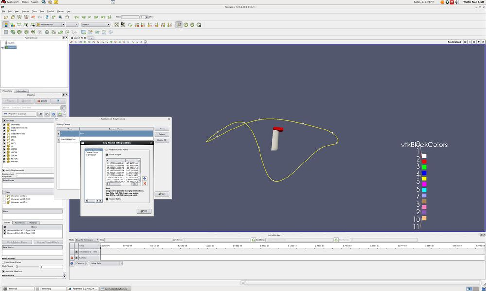
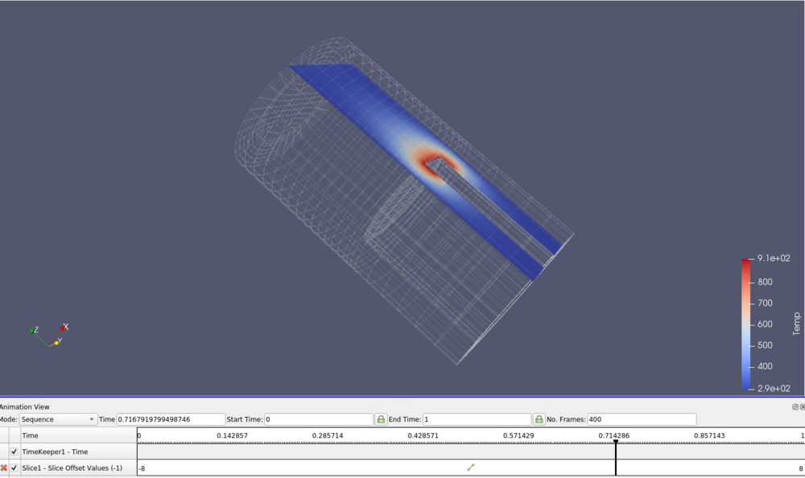

Introduction
============

This tutorial deals with advanced topics in animations.

The Animation View
------------------

-   Open the data set can.exo, which can be downloaded at
    <http://www.paraview.org/paraview/resources/software.html>
-   On the Properties tab, select all variables and press the Apply
    button
-   Drag the can around with the left mouse button
-   Move forward to timestep number 5
-   Color by DISPL
-   (If you changed the order of the steps above, you may need to click
    \"Rescale to Data Range\"
-   View → Animation View

-   Grab the slider bar and move it back and forth.

Real Time
---------

-   In the Animation View window, change the mode to Real Time, and the
    Duration to 100.
-   Play. Notice that the can motion is now very slow. We are saying
    that we want the whole animation to last 100 seconds.
-   Note - this can also be used to speed up datasets with a large
    number of time steps. Set the Duration to 10, and ParaView will
    animate over all time in 10 seconds. Obviously, this is dependent on
    the whether ParaView can keep up with this frame rate!

Temporal Interpolator
---------------------

-   In the Animation View window, change the mode to Sequence, and the
    No. Frames to 200.
-   Filters → Temporal → Temporal Interpolator.
-   Play. Notice that the can motion is now smooth. ParaView is
    interpolating between frames, and making 200 time steps.
    -   Note that this only works with data that stays consistent
        through the whole time sequence. AMR (Adaptive Mesh Refinement)
        data does not work with the Temporal Interpolator.

Move the camera
---------------

There are four ways to move the camera. they are:

-   Orbit
-   Follow Data
-   Interpolate Camera Locations
-   Follow Path

### Orbit Camera

We are going to make the camera rotate around our data.

-   -   **Edit → Reset Session**
    -   Open the data set can.exo.
    -   Apply.
    -   **+Y**
    -   **View → Animation View**
    -   Add a camera. Default motion is Orbit, so click the blue +.
    -   A **Create Orbit** dialog will appear. Take the defaults, hit
        OK.
    -   Play.

### Camera Follow Data

We are going to make the camera follow the data.

-   -   **Edit → Reset Session**
    -   Open the data set can.exo.
    -   Apply.
    -   **+Y**
    -   **View → Animation View**
    -   Add a camera. Change **Orbit** to **Follow Data**. Click the
        blue +.
    -   Play.

Note that the follow data option will follow the data from whatever
filter is highlighted. This means that you can choose one cell, run the
**Extract Selection** filter, and follow this cell. Note that you must
keep visibility on for this cell. If needed, you can turn the cell\'s
Opacity (Properties tab) to 1%, making it disappear. By turning
visibility on for your whole dataset, you can follow the cell but
display all of your data.

### Interpolate Camera Position

We are going to move the camera along a straight line. We want to move
the camera to follow the can.

-   -   **Edit → Reset Session**
    -   Open the data set can.exo.
    -   Apply.
    -   **+Y**
    -   **View → Animation View**
    -   Add a camera. Change **Orbit** to **Interpolate Camera
        Position**. Click the blue +.
    -   Left click on the white section of the camera row that just
        appeared.
    -   An **Animation Keyframes** dialog will open.
    -   Left click the top **Position**.
    -   Use Current. OK
    -   Play to the last timestep. Move the can dataset back into the
        center of the screen. **Tip** - Don\'t hit **Reset**.
    -   Left click the bottom **Position**.
    -   Use Current. OK.
    -   OK

<!-- -->

-   -   Play.

You can also create an intermediate destination for the can by going to
the Animation Keyframes dialog, and selecting New. Then, follow the
directions above. Experiment by adding more keyframes and different
camera angles.

One way to create tracks in 3d space is to use Interpolate Camera
Location, and place the control points onto a plane. Then, copy these
control points, and then copy them into the 3d simulation you want to
animate.

### Follow Path

We are going to move the camera along a spline. Advanced operation.

-   -   **Edit → Reset Session**
    -   Open the data set can.exo.
    -   Apply.
    -   **+Y**
    -   **View → Animation View**
    -   Add a camera. Change **Orbit** to **Follow Path**. Click the
        blue +.
    -   Left click on the white section of the camera row that just
        appeared.
    -   An **Animation Keyframes** dialog will open.
    -   Left click on **Path**.
    -   Click on Camera Position.
    -   Now, in the 3d view, zoom out. Rotate the can. You will see a
        yellow circle with white spheres. Drag the spheres around.
    -   OK.
    -   OK.

<!-- -->

-   Play.

One way to create tracks in 3d space is to use Interpolate Camera
Location, and place the control points onto a plane. Then, copy these
control points, and then copy them into the 3d simulation you want to
animate.

Animating a Filter
------------------

In the previous example we showed how to manipulate the camera using the
Animation View tools. In this example we will show how to animate a
filter. Our goal is to move a slice through our dataset over time.

-   Lets start from scratch. One way is to go Edit/ Reset Session. Ok.
-   If you closed it, bring up the Animation View.
-   Open disk\_out\_ref.exo, all variables on, Apply.
-   Slice filter. Apply. Turn off the **Show Plane**.
-   In the **Animation View**, change Mode to Sequence, and number of
    frames to 400.
-   We want to create a track that is Slice, Slice Offset Values. Click
    the blue **+**.
-   Double click on the track. This will bring up a dialog, and will set
    the start and end.
-   Change the starting value to **-8** and the ending value to **8**.
-   **Play**.

Data Animation
--------------

In this example we will show how to animate your data set. Our goal is
to show one data set, then fade into another dataset. This can be handy
when one physics simulation runs for an early time period, and another
physics simulation runs for the later time period.

-   Lets start from scratch. One way is to go File/ Disconnect. Ok.
-   If you closed it, bring up the Animation View.
-   Open can.exo, all variables on, Apply.
-   Open can.exo again, all variables on, Apply.
-   Select the upper can.exo, and change to color by DISPL. Last time
    step, Rescale to Data Range, first time step.
-   Select the lower can.exo, and chage the representation to Wireframe.

We now want to fade from the first version of the can to the second
version of the can. This is done as follows:

-   On the Animation View, on the can.ex2 pulldown menu, select the
    upper can.ex2. Right of there, use the pulldown menu to select
    Opacity. Click the blue plus sign.
-   Do the same for the lower can.ex2.
-   Click on the upper can.ex2 white horizontal bar. Double click on the
    upper value, change it to 1. Double click the lower value, change it
    to 0. OK.
-   Play.

You can substitute Visibility for Opacity when you add tracks to the
Animation View. Then, on one dataset, you can run visibility of 1 for
half of your time, and run visibility of 1 for the other dataset for the
second half of your time. Thus, you will show the first simulation for
the first half of your animation, and the second simulation for the
second half.

Warp Vector Filter
------------------

-   If your dataset has displacement data, but it is not using a
    variable name that ParaView recognizes, you can still animate your
    data. Choose the Filters/ Alphabetical/ Warp Vector filter.

Acknowledgements
================

Sandia National Laboratories is a multi-mission laboratory managed and
operated by National Technology and Engineering Solutions of Sandia,
LLC., a wholly owned subsidiary of Honeywell International, Inc., for
the U.S. Department of Energy's National Nuclear Security Administration
under contract DE-NA-0003525.
