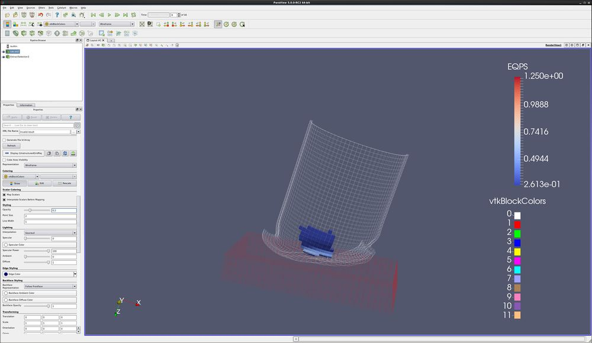

Introduction
============

This tutorial covers data analysis.

Find Data dialog
----------------

The **Find Data** dialog box is used to select points or cells, to show
the data for these points or cells, to control label display on your
data in the 3d view, and as a shortcut to run data analysis filters. We
will explore this dialog box using an example.

-   Open a dataset and the Find Data dialog.
    -   Open the dataset can.exo. Turn on all variables. **Apply**.
    -   **Edit**/ **Find Data**. You can also open the Find Data dialog
        using the icon
        
-   We will select a GlobalElementId.
    -   Find **Cells** from **can.ex2**
    -   Change pulldown to **GlobalElementId**. Leave as **is**.
        Enter 100.
    -   **Run Selection Query**

<!-- -->

-   We will select two GlobalElementIds.
    -   Find **Cells** from **can.ex2**
    -   Change pulldown to **GlobalElementId**. Change to **is one of**.
        Enter 100, 102.
    -   **Run Selection Query**

-   We will select the maximum EQPS.
    -   Move forward one timestep. EQPS for timestep 0 is all the same -
        0.
    -   Find **Cells** from **can.ex2**
    -   Change pulldown to **EQPS**. Change to **is max**.
    -   **Run Selection Query**
    -   **Play forward**

Notice that the data for the selected cell (or point) is displayed in
the spreadsheet.

If desired, the maximum (or minimum) cell can be found, and this
selection can be frozen. The same cell will then be selected for all
timesteps. Use the **Freeze Selection** button to freeze selections.

We can also display cell or point data on the 3d view. This is done with
**Cell Labels** and **Point Labels**.

-   -   Open the **Cell Labels** pulldown, and select EQPS.

Cell, Point and Block Selections
--------------------------------

ParaView has a very powerful group of selection tools. Selections are
found as a group of icons in the upper left corner of the 3d view.

-   More than one selection can be active at a time. Use the **<CTRL>**
    key. You can also use the **Add Selection**, **Subtract Selection**
    and **Toggle Selection** icons.
-   Variable data can be printed on the screen for any cell that is
    selected. See the section on **Find Data**.
-   Selections can be used as input to numerous **Data Analysis**
    filters.

<!-- -->

-   -   **Select Cells On**. Select one or more cells on the surface of
        your object. Either click or rubber band select works.
        Shortcut - **s**.
    -   **Select Points On**. Select one or more points on the surface
        of your object. Either click or rubber band select works. Within
        a tolerance, the nearest point will be selected. Shortcut -
        **d**.
    -   **Select Cells Through**. Select cells through your dataset.
        This is known as a Frustum select. Shortcut - **f**.
    -   **Select Points Through**. Select points through your dataset.
        This is also known as a Frustum select. Shortcut - **g**.
    -   **Select Cells With Polygon**. Select cells on the surface of
        your dataset by drawing a polygon. No shortcut.
    -   **Select Points With Polygon**. Select points on the surface of
        your dataset by drawing a polygon. No shortcut.
    -   **Select Block**. Select one or more blocks. Either click or
        rubber band select works. Shortcut - **b**.
    -   **Interactive Select Cells On**. Interactively select cells on
        the surface of your dataset. If you click on a selection, it
        will become permanent. You can have numerous permanent
        selections. No shortcut.
    -   **Interactive Select Points On**. Interactively select points on
        the surface of your dataset. If you click on a selection, it
        will become permanent. You can have numerous permanent
        selections. No shortcut.
    -   **Hover Points On**. This will display all of the data available
        on this point or cell. Interactive.
    -   **Clear Selection**.

Spreadsheet and histogram view
------------------------------

ParaView can visualize data in a spreadsheet view. The spreadsheet view
can be configured to show all data, or only selected data. you can also
select a row in the spreadsheet view and it will be selected in the 3d
view.

You can also show your data as a histogram. This will show you how many
cells have different attributes.

-   Open Can.exo.
-   Highlight the can window, and **Select Cell** on the can.
-   **Split Horizontal**
-   **Split Vertical**
-   In the upper right window, select **Spreadsheet View**.
-   Select the **Show Only Selected Elements** check box (next to
    Precision).
-   **Note that the Spreadsheet can now be sorted - including in
    parallel.**
-   Select a different cell on the can.
-   Highlight the lower right window.

We want magnitude of the DISPL vector.

-   Calculator. Formula → **mag(DISPL)**. Result → **MagDispl**.
-   **Filters**→**Data Analysis**→**Histogram**. **Apply**.
-   Change **Select Input Array** to **MagDispl**. Apply.
-   Animate forward in time one step at a time.
-   Play
-   If desired, freeze the X and Y axis in the Properties tab using
    **Axis Use Custom Range**

Advanced Spreadsheets
---------------------

-   You can either display all of your dataset\'s points or cells in
    your spreadsheet, or only those that are selected in the 3d view.
    With the **spreadsheet** window selected, on the **Display** tab,
    click **Show only selected elements**.
-   When cells or points are selected in the 3d window, the appropriate
    row(s) in the spreadsheet view will be highlighted.
-   Highlighting works both ways - if you select a row or rows in the
    spreadsheet view, the cell or point on your dataset will be
    selected.
-   You can select multiple rows in the spreadsheet by holding down the
    **<ctrl>** key, and can select ranges of rows by holding down the
    **<shft>** key.
-   **Note that the Spreadsheet can now be sorted - including in
    parallel.**

Frustrum tool
-------------

-   When you are using the **Select Cells Through** or **Select Points
    Through**, it is possible to see the frustrum (the 3d space you
    selected). this toggle can be found in the **Find Data** dialog box.

Extract Selection
-----------------

-   Open can.exo.
-   Using the **Select Cells Through** icon, select a few dozen cells.
-   Open the **Find Data** dialog, and click **Freeze Selection**. That
    way, we don\'t have the can moving out of the frustum over time.
-   **Extract Selection** (found on the Find Data dialog), **Apply**.

Note that the Extract Selection is also found under **Filters/ Data
Analysis**.

Spreadsheet data by time
------------------------

-   Open can.exo.
-   On the toolbar, push the **Select Points On** icon. This will allow
    you to manually select a point on your data set. Select a point on
    your dataset.
-   **Filters→Data Analysis→Plot Selection Over Time**, then **Apply**.
-   Split Vertical, Spreadsheet View, and with the Spreadsheet View
    highlighted, turn on the eyeball in front of the
    **PlotSelectionOverTime** filter.
-   Note that you can then write this data out to a .csv file using
    **File** → **Export**.

Acknowledgements
================

Sandia National Laboratories is a multi-mission laboratory managed and
operated by National Technology and Engineering Solutions of Sandia,
LLC., a wholly owned subsidiary of Honeywell International, Inc., for
the U.S. Department of Energy's National Nuclear Security Administration
under contract DE-NA-0003525.
