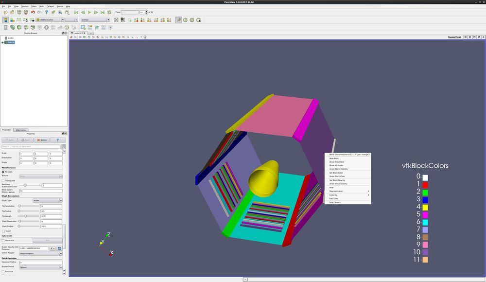
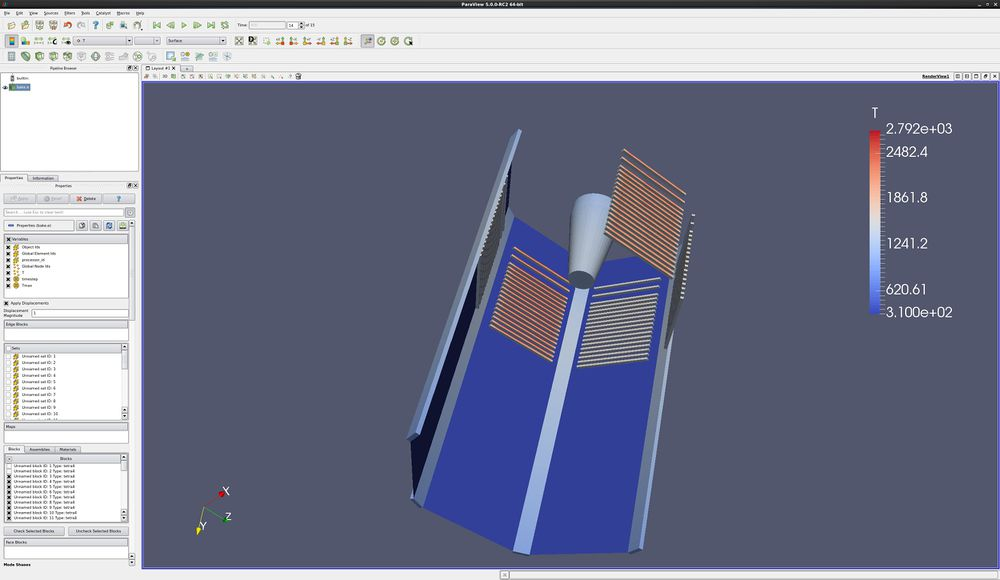
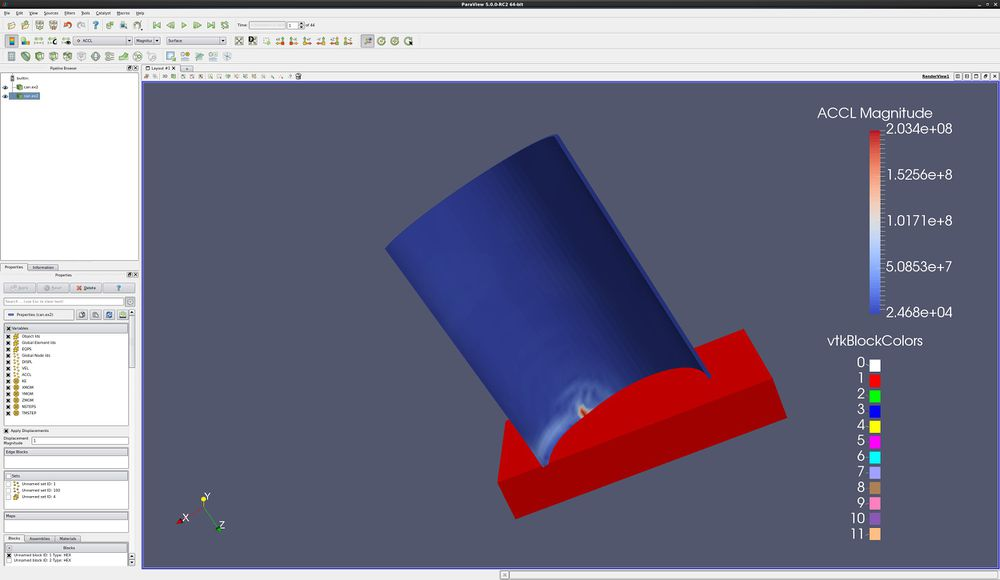

Introduction
============

This tutorial covers multiblock processing. It also uses the dataset
bake.e, which can be found in the ParaView Data downloads from
paraview.org.

Block commands onscreen menu
----------------------------

Bake.e is a dataset that simulates the heating of a cone in a test
facility. It has numerous blocks. T (for temperature) is the primary
variable of interest.

-   Open the dataset bake.exo. Turn on all variables. Apply. Your
    dataset is now colored by block.
-   Change vtkBlockColors to T. Your dataset is now colored by
    temperature. Play forward in time, and look into the simulation. Be
    sure to rescale to data range.
-   Change color back to vtkBlockColors.

Notice that this model has 6 sides, and there are 12 annotation colors.
Thus, they repeat. Lets make them random.

-   Properties tab, Advanced. Slide down towards the bottom, and find
    **Block Colors Distinct Values**. Change this to **11**.

<!-- -->

-   Right click on a side (a block). Notice that the bock name and ID
    are shown.
-   Right click on a side. Change the block\'s color and opacity.
-   Right click on a side. Hide, then unhide the block.

Don\'t load some blocks
-----------------------

You can easily change which blocks you load. This is done through
selections. Here is an example.

-   Open the dataset bake.exo. Turn on all variables. Apply. Your
    dataset is now colored by block.
-   Choose the Select Block icon (or hit the **b** key), then rubber
    band select the blocks on the outside edge of bake. You have
    selected numerous blocks.
-   On the Properties tab, slide down to the section named Blocks. Click
    **Uncheck Selected Blocks**. Click **Apply**.

Load the same dataset twice
---------------------------

-   Open the dataset can.exo. Turn all variables on. Only turn on block
    ID **2**. **Apply**.
-   Open the dataset can.exo. Turn all variables on. Only turn on block
    ID **1**. **Apply**.
-   Change the timestep to 1.
-   Color by **ACCL**.
-   Play

Extract Block and Extract Selection
-----------------------------------

Two filters that can also be used to partition your data are the Extract
Block and Extract Selection filters. Instead of reading your data in
twice, read it in once and Extract Block twice.

Multi-block inspector
---------------------

The **multi-block inspector** can also be used to toggle visibility, and
change colors and opacities of selected blocks. The **multi-block
inspector** can be found under the **View** menu.

Acknowledgements
================

Sandia National Laboratories is a multi-mission laboratory managed and
operated by National Technology and Engineering Solutions of Sandia,
LLC., a wholly owned subsidiary of Honeywell International, Inc., for
the U.S. Department of Energy's National Nuclear Security Administration
under contract DE-NA-0003525.
