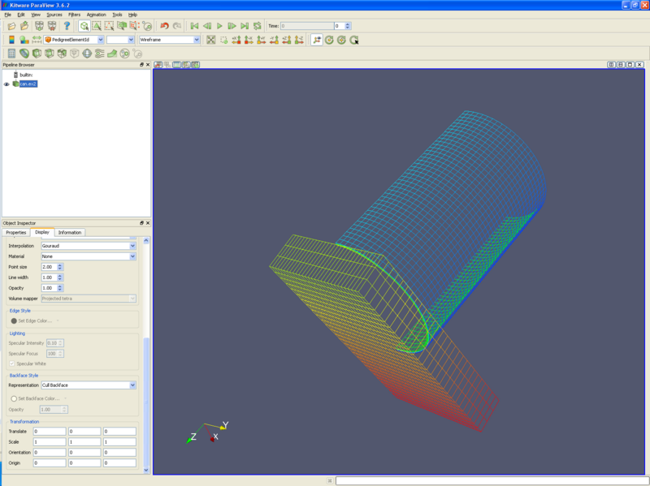

Introduction
============

This wiki page holds tips and tricks that don\'t fit anywhere else, or
are small enough that they don\'t deserve their own tutorial.

Creating a Custom Filter
------------------------

-   Open data set disk\_out\_ref.exo. This dataset can be downloaded at
    <http://www.paraview.org>. On the Properties tab, select all
    variables and press the Apply button. On the Display tab, select
    Color by Temp.
-   Clip filter. Clip type -- Scalar. Apply. (The Scalars and Values
    don't matter right now)
-   From the Tools menu, select Create Custom Filter.
-   Name this filter ClipByScalar (IsoVolume). Next.
-   Take the default inputs. Next.
-   Take the default outputs. Next.
-   Select the clip (in the left window), and pull down the pull down
    menu for Property. Select Scalars. Hit the blue plus sign. Do the
    same for Value and Inside Out.
-   Finish.
-   Now, delete the clip filter in the pipeline browser.
-   Open Filters/ Alphabetical/ ClipByScalar. Turn Scalars to Temp,
    enter a Value of 400, and hit Apply. We now have a ClipByScalar
    filter (sometimes incorrectly know as an IsoVolume filter).

Temporal Statistics Filter
--------------------------

-   Open dataset can.exo. Read in all variables. Apply.
-   Filters → Temporal → Temporal Statistics. Apply.
-   Color by ACCL\_average. Color by ACCL\_maximum. Color by
    DISPL\_average. You can now visually see average acceleration,
    maximum acceleration and average displacement of each cell.
-   To see the ranges of these variables over the whole mesh, look in
    the Information tab.

Creating vectors from 2 or 3 scalars
------------------------------------

-   Open dataset can.exo. Read in all variables. Apply.
-   Filters → Common → Calculator
-   Build the vector equation using the iHat, jHat and kHat buttons on
    the calculator. For instance, this example will create a vector
    representing the acceleration in the X and Y plane.
-   Result Array Name → "ACCL-XY"
-   Equation is "ACCL\_X\*iHat+ACCL\_Y\*jHat"
-   Be sure to color by variable ACCL-XY.

Mesh quality
------------

-   Mesh quality is created using the Mesh Quality filter.
-   Open dataset can.exo. Read in all variables. Apply.
-   Filters → Alphabetical → Mesh Quality. Take the defaults. Apply.
-   Next, we want to only look at those cells that are below some
    threshold of quality. Filters → Common → Threshold.
-   Choose Scalars of "Quality", and Lower Threshold of 4 and Upper
    Threshold of 1000.
-   Turn visibility of can.ex2 on, and Representation of Wireframe.
-   Animate (Play).

Backface style
--------------

-   It is possible to change the backface style of a wire frame object.
-   Open dataset can.exo. Apply.
-   Color by **PedigreeElementId**.
-   Representation **Wireframe**.
-   Open the Display tab. Slide down a few pages until you find
    **Backface Style**.
-   Change **Backface Style - Representation** to **Cull Backface**.

Animating a static vector field
-------------------------------

-   If you have a vector field in your data, you can animate a static
    dataset.
-   Our goal is to create a set of streamlines from a vector field,
    place points on this set of streamlines, and animate the point down
    the streamlines. We will also add glyphs to the streamline points.
-   Open disk\_out\_ref.exo. Turn all variables on, and hit the apply
    button.
-   Click the -X icon.
-   Stream tracer filter. (We are already streamtracing on V).
    Optional - I changed the Opacity to 0.4. Apply.
-   Contour filter. Contour on **IntegrationTime**. Apply.
-   Glyph filter. Vectors **V**. Unckeck **Random Mode**. Optional - I
    increased the scale factor by about 5X. Apply.
-   View/ Animation View.
-   Mode **Sequence**, No. Frames: **100**.
-   Change the pulldown box next to the blue **+** to be **Contour**.
-   Click the blue **+**.
-   Now, click the play button. In the pipeline browser, I also turned
    off visibility for the Contour filter.

<!-- -->

-   -   Note - there seems to be a bug in ParaView, where if you click
        on the Contour filter again, it will ask you to apply. Then
        everyting won\'t work. Don\'t hit the apply!

Acknowledgements
================

Sandia National Laboratories is a multi-mission laboratory managed and
operated by National Technology and Engineering Solutions of Sandia,
LLC., a wholly owned subsidiary of Honeywell International, Inc., for
the U.S. Department of Energy's National Nuclear Security Administration
under contract DE-NA-0003525.
