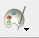
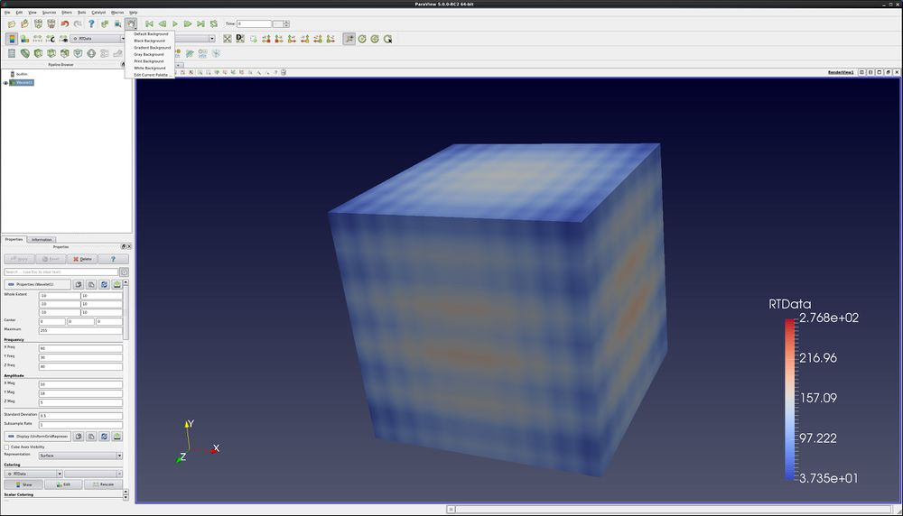
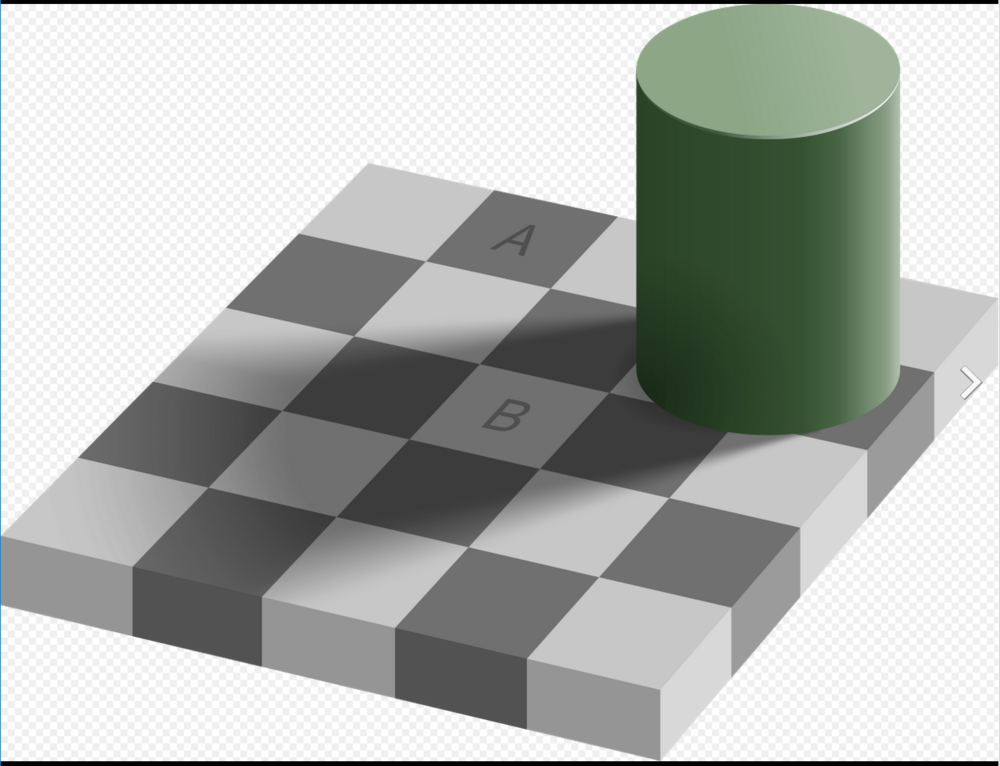
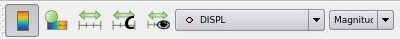
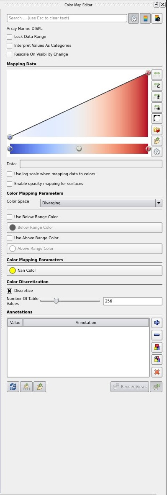
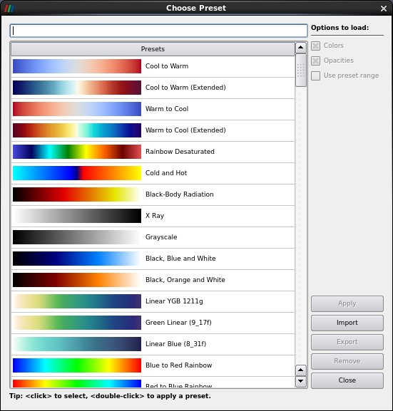
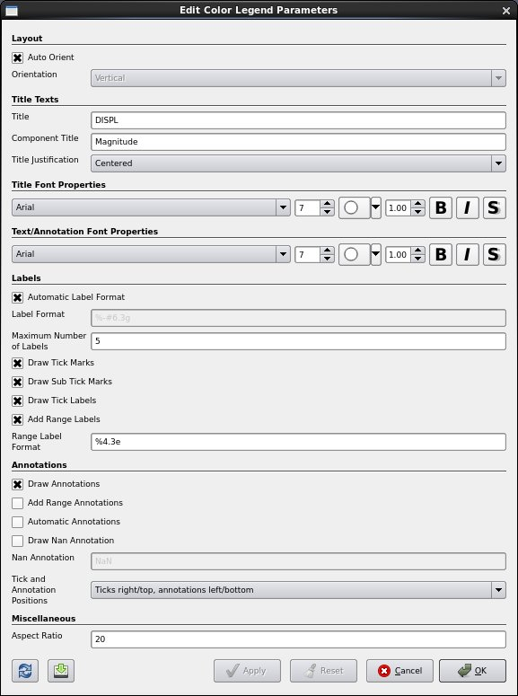
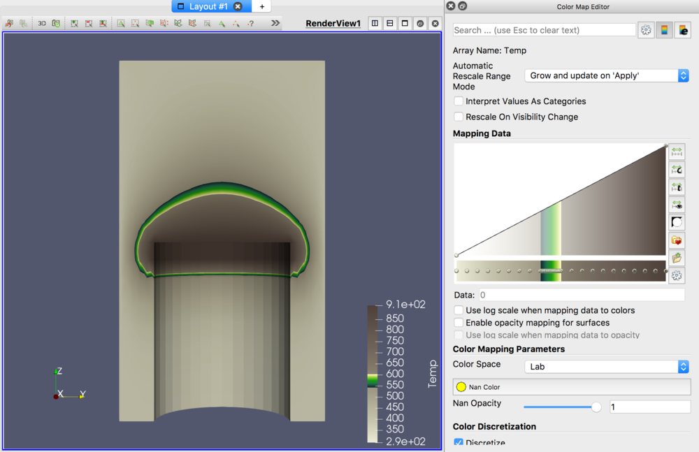
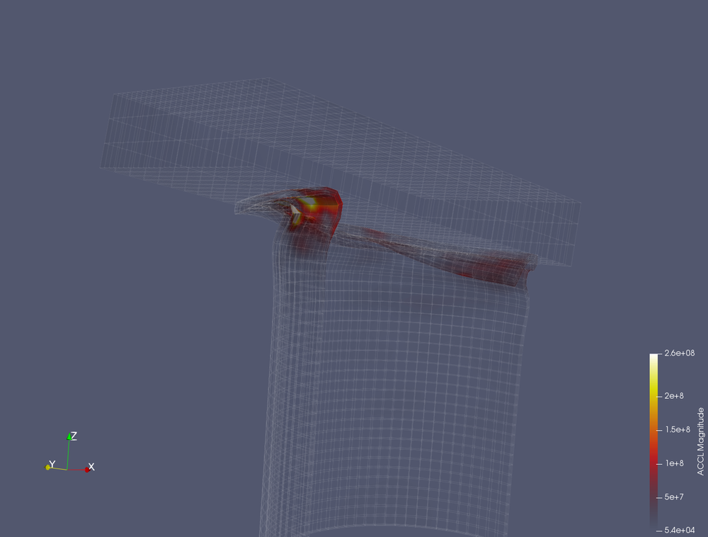

Introduction
============

This usecase presents a few of the more important new ParaView GUI
features. A full list of features can be found in the ParaView Guide.

Data is opened by going to **File → Open**. Example data files can be
found on the ParaView web page at <http://www.paraview.org>

Color palette
-------------

ParaView allows users to easily control the color palette. This is done
with the **Load a color palette** icon.
 Changing color
palettes does much more than just changing the background - it also
changes the font colors for other annotations. Options are default gray,
black, white and gradient. You can also create custom color palettes.

Here is an example of a gradient background, with the color palette menu
displayed.

A famous example of surrounding colors changing a percieved brightness
of an object is Edward Adelson\'s Checker Shadow illusion.

Color Map Editor
----------------

-   If needed, open can.exo and read in all of the variables.
-   Select the **DISPL** variable.
-   Move forward one time step using the **Next Frame** icon.
-   Here is the coloring toolbar. Icons are as follows:
    -   Toggle color legend visibility.
    -   Edit color map.
    -   Rescale to data range (set Min and Max from this timestep).
    -   Rescale to custom data range (manually input Min and Max values.
    -   Rescale to visible data range (set Min and Max from visible
        objects this timestep)

-   Click on the **Edit Color Map** icon.

-   The **Color Scale Editor** is used to change the colormap.
    -   Select the **Use log scaling when mapping data to colors** check
        box. Notice what has happened to the colors on the can. Unselect
        **Use log scaling\...** check box.
    -   Select the **Enable opacity mapping for surfaces** check box.
        Notice what has happened to the colors on the can. Unselect
        **Enable opacity mapping \...** check box.
    -   Select the **Rescale to Data Range** icon. You already know what
        this does.
    -   Select the **Rescale to Custom Range** icon. Set custom minimum
        and maximum values for the Color Legend.
    -   Select the **Rescale to Data Range over all timesteps** icon.
        This will read in all of your data, and set the min and max
        based upon all timesteps.
    -   Select the **Rescale to Visible Range** icon. Rescales based
        upon what is currently visible. To see this work, click -Z, and
        then roll the can down slightly to hide the can itself. Click
        the **Rescale to Visible Range** icon.
    -   Invert the transfer function. Invert the color table.
    -   Select the **Choose Preset** icon. Choose **Cool to Warm**, then
        OK. Notice what has happened to the colormap. This is an easier
        to understand color map than the rainbow one that all of us are
        use to. Next, choose the **Black-Body Radiation** preset.
        Although harder to understand (requiring an understanding of the
        layout of the rainbow colors), this one makes prettier pictures.
        The best color map to use is the default one.

-   Advanced. You can edit each color and opacity of the color map.
    -   Nan Color - this is the color ParaView will use to paint nans in
        your data.
    -   Click the advanced icon at the top. You can mark cells or points
        that are outside of the normal range of the color map.
    -   Click the color legend with the **e**. this is the **Color
        Legend Editor**.

Custom Color Maps
-----------------

ParaView allows you to import custom color maps. This is also done on
the **Color Map Editor**, **Presets** dialog. An excellent source for
scientific visualization color maps is the SciVizColor website, located
here: <https://sciviscolor.org>. Lets add a custom color map.

-   Go to webpage <https://sciviscolor.org>.
-   **Colormap**. **Wave & Highlighting Colormaps**.
-   **Highlight Inserts**
-   Select one of the middle color maps. Save this color map somewhere
    you can find it.
-   Open **disk\_out\_ref.exo**. Turn all variables on. Press **Apply**
-   **-X**
-   **Clip** Filter. Press **Apply**. Turn off the **Show Plane**
    button.
-   Select variable **Temp**
-   Open the **Color Map Editor**.
-   Open the **presets** dialog.
-   **Import**. Select the color map .xml file that you downloaded.
-   **Advanced**
-   Now, select the new color map.

Opacity mapping
---------------

-   Leave the color editor open.
-   Open **can.exo**. Turn all variables on. Press **Apply**.
-   **+Y**
-   Go to last timestep.
-   Paint by **Accl**.
-   Go to first timestep.
-   Choose a black body palette.
-   Enable opacity mapping for surfaces.
-   Play
-   Filters/ Alphabetical/ Pass Arrays. Apply.
-   Change this filter to be wireframe, solid color. Opacity 0.1.
-   Back on can.exo, turn visibility on. Click on and change the opacity
    transfer function

-   Turn off the enable opacity mapping for surfaces.
-   Volume render.
-   Play

Acknowledgements
================

Sandia National Laboratories is a multi-mission laboratory managed and
operated by National Technology and Engineering Solutions of Sandia,
LLC., a wholly owned subsidiary of Honeywell International, Inc., for
the U.S. Department of Energy's National Nuclear Security Administration
under contract DE-NA-0003525.
