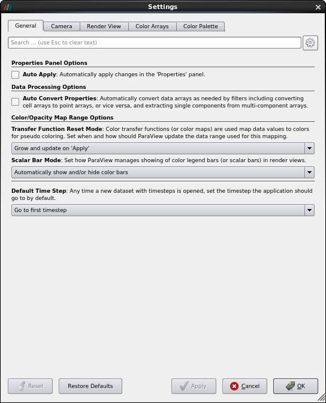
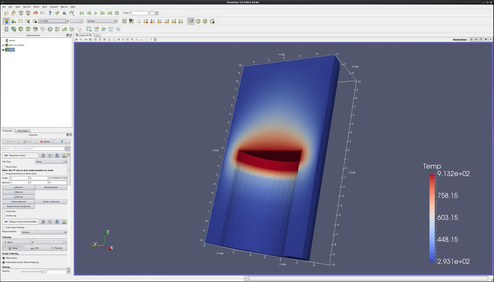

Introduction
============

This usecase presents a few of the more important new ParaView GUI
features. A full list of features can be found in the ParaView Guide.

Data is opened by going to **File → Open**. Example data files can be
found on the ParaView web page at <http://www.paraview.org>

Customize Settings
------------------

Paraview allows users to customize settings. The most important ones are
found in **Edit → Settings → General**. These are:

-   -   Auto Apply - Also found as an icon below the Macros menu.
    -   Auto Convert Properties - Automatically call **Cell to Point**,
        **Point to Cell**, or extract components from vectors as needed.
    -   **Transfer Function Reset Mode** - when to update the minimum
        and maximum for the **Color Legend**.
        -   **Grow and update on Apply** - default. This means only
            update when told to.
        -   **Grow and update every timestep**. This means to update the
            Minimum and/or Maximum only if the current timestep exceeds
            these numbers. Basically, Add and grow.
        -   **Clamp and update every timestep**. Set the minimum and
            maximum every timestep, from the data this timestep. This is
            not recommended behavior, since it makes comparing frame to
            frame confusing.
    -   **Scalar Bar Mode** - just leave this one alone.
    -   **Default timestep** -
        -   **Go to first timestep** - default.
        -   **Go to last timestep**

Information tab
---------------

-   Open can.exo. Turn all of the variables on. Press **Apply**.
-   Open the Information tab.
    -   The first section tells you what blocks and sets you have in
        this dataset.
    -   Next comes properties on this dataset.
    -   The Statistics section tells you the number of cells and points
        in your dataset. Note that Memory is incorrect. (I believe it is
        actually memory used on the graphics card.)
    -   Data Arrays gives information on each variable, including the
        min and max. Note that this is for the current timestep only.
    -   Bounds give the X, Y and Z bounds of the bounding box.
    -   Last is a list of all timesteps, with their associated time.

Right click menu based commands
-------------------------------

-   Open can.exo. Press **Apply**.
-   Right click on the object.
    -   Block Name
    -   Block specific visibility commands
    -   Block specific coloring and opacity
    -   Representation and coloring commands
    -   Link Camera

Split windows
-------------

-   Open can.exo. Press **Apply**.
-   Drag the can around with the left mouse button until you can see the
    can.
-   **Split screen vertical** -- i.e., one above the other. This is the
    little box with the horizontal line.

-   Select 3D View.
-   Turn the eyeball on for can, in the Pipeline Browser.

<!-- -->

-   **Split screen vertical** -- i.e., one above the other. This is the
    little box with the horizontal line.

-   Select 3D View.
-   Turn the eyeball on for can, in the Pipeline Browser.

<!-- -->

-   This last was a mistake. **Undo, Undo, Undo**. **Undo** is the red
    counter clockwise button.

-   Select the bottom viewport.
-   **Split screen horizontal** -- i.e., one next to the other. This is
    the little box with the vertical line.

-   Select **3D View**.
-   Turn the eyeball on for can, in the Pipeline Browser.

<!-- -->

-   Now lets link the cameras. Right click on the upper window, and
    click on **Link Camera**. Click on the lower right window. Do the
    same between the two bottom windows.

<!-- -->

-   Click in the lower left window, color by **DISPL**. Turn on Color
    Legend Visibility.
-   Click in the lower right window, color by **ACCL**. Turn on Color
    Legend Visibility.
-   Click in the upper window, color by **VEL**. Turn on Color Legend
    Visibility.
-   Go to the last frame, click on **Rescale to Data Range**, go to
    first frame, **play**.

Move/control windows
--------------------

-   Select the top window.
-   Click on the **Maximize** button of the upper window.

-   Click the **Restore** button of the upper window.
-   Next, using the left mouse button, grab the title bar of the lower
    left window and drag/drop it into the upper window. These two
    windows have now switched places.
-   Finally, grab the divider between the two lower windows and drag it
    left and right. You can also move the divider between the upper and
    lower windows.

Unlink windows
--------------

-   To unlink the windows, we use the Link Manager. **Tools/ Manage
    Links**. Select the second link, and click **Remove**. Close.
-   Now, grab and rotate can in the three windows.
-   Finally, delete the bottom two windows, using the **Close** button.

Control the center
------------------

-   Click on the **Show Center** icon. Notice that this toggles the
    center cross.
-   Click on the **Pick Center** icon, then select a location on the
    can. Rotate the can, and notice where it is rotating.
-   Click on the **Reset Center** icon, returning the rotation location
    and center cross to the center of the object.

-   You can always recenter the object using the **Reset** icon.

Auto apply
----------

ParaView now has the ability to auto apply commands. This button is to
the left of the blue question mark, and looks like
this:

Properties tab
--------------

The properties tab has three buttons on top. They are the **Apply**
button, the **Reset** button and the **Delete** button. The **Reset**
button will undo any Properties tab changes that a user accidentally has
made. Below these three buttons is a search feature. Search will find
Properties tab items, irrespective of them being standard or advanced.
An example would be **Opacity**.

Advanced Properties tab
-----------------------

The properties tab initially is in standard layout. To get to the
advance layout, click the gear icon. Side and edge sets for the Exodus
reader are found here. Mode shapes are also found on the Advanced
Properties tab. The advanced layout icon looks like
this:

Copy/Paste/reset/Save parameters
--------------------------------

On each section of the Properties tab there are four icons, as follows:

-   Copy the state of that section of the Properties tab to the
    clipboard.
-   Paste the state from the clipboard to this section of the properties
    tab. This allows you to copy and paste state between filters.
-   Reset to factory defaults.
-   Save this state as the user default.

Move the camera
---------------

ParaView allows the user to change and store the position of the camera.
Such controls as **Roll**, **Elevation** and **Azimuth** are available.
The **Adjust Camera** icon is on the left side of the row of icons at
the top left of the 3d window. It looks like this:

The **Adjust Camera** dialog box looks like this:

Useful controls that I often use (in order) are as follows:

-   **Custom Configure** - Save up to 4 camera positions.
-   **Azimuth** - rotate around the vertical axis. Be sure to hit the
    button after entering a number.
-   **Elevation** - rotate around the horizontal axis in the plane of
    the screen.
-   **Roll** - rotate around the axis coming out of the screen.
-   **View angle** - basically a zoom in.
-   **Camera position** - where the camera is.
-   **Focal point** - where the camera is looking.
-   **View Up** - I don\'t know what this is.
-   You can always recenter the object using the **Reset** icon. First,
    however, be sure to change **View angle** back to 30.

Matplotlib characters
---------------------

-   If needed, open can.exo and read in all of the variables.
-   Select the **DISPL** variable.
-   Move forward one time step using the **Next Frame** icon.
-   We want to add an alpha character after DISPL.
    -   Open the color editor.
    -   Open the Edit Color Legend icon. It is the little color legend
        with the \'e\' over it.
    -   Modify the Title **DISPL** to say **DISPL \$\\alpha\$**
-   Here is how to change a 2d plot of **EQPS** to **EQPS (uV/m)**
    -   Plot Over Line. Apply. Turn off all variables other than EQPS.
    -   Change the **Legend Name** from **EQPS** to **EQPS
        (\$\\frac{\\mu V}{m}\$)**
-   Matplotlib Mathtext formats are described here:
    <http://matplotlib.org/users/mathtext.html>

Axes Grid
---------

-   Open dataset disk\_out\_ref.exo.
-   On the Display tab, scroll down and select Axis Grid
-   Note that you can edit the Axis Grid attributes.

Lighting - Specular
-------------------

It is possible to change the specular highlights in ParaView. This is on
the Properties tab, about half way down. It is called Lighting:
Specular. Note that reflections can look like the center of the color
map, thus specular highlights are turned off by default.

Slice View and Layouts
----------------------

-   Open disk\_out\_ref.exo. Turn all variables on. Apply. Color by
    Temp.
-   Clip. Turn off the Show Plane. Apply.

ParaView supports numerous simultaneous layouts, or windows, into your
data.

-   Select the X to the right of Layout \#1 (upper left side of the 3d
    window).

ParaView also supports different views than 3d views. Here is how to
show your data as a slice view.

-   Select Slice View
-   Turn visiblity on for disk\_out\_ref.exo. Color by Temp.
-   Left click in the window, and drag disk\_out\_ref around.
-   Move the left, upper and right clip planes by dragging the black
    wedge.

You can intermix different view types.

-   Split horizontal.
-   Turn visibility on for disk\_out\_ref. Paint by Temp.

You can also connect the cameras for the different views. This can be
done through the **Tools** → **Add Camera Links** menu.

Render View (Comparison)
------------------------

ParaView can compare different time steps at the same time. This is
called Comparative View.

-   Open can.exo. All vars on. Apply.
-   Split view horizontal. Select **Render View (Comparitive)**
-   Turn on visibility on the can.
-   View/ Comparitive View inspector.
-   Click on the blue +. This creates a 2X2 set of views of can.exo at
    four different timesteps.

Customize Shortcuts
-------------------

You can create shortcuts to Menu items (such as Filters) in ParaView.

-   Tools/ Customize Shortcuts.
-   Find Wavelet. If it has a shortcut already, click Clear.
-   Click in the **Press Shortcut** button. Now, select a shrtcut, such
    as **CTRL W**.
-   Close
-   Now, click **CTRL W**, and you have a Wavelet. Hit apply.

Menus and Help
--------------

Cover all menus.

Acknowledgements
================

Sandia National Laboratories is a multi-mission laboratory managed and
operated by National Technology and Engineering Solutions of Sandia,
LLC., a wholly owned subsidiary of Honeywell International, Inc., for
the U.S. Department of Energy's National Nuclear Security Administration
under contract DE-NA-0003525.
