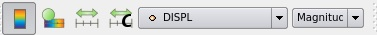
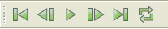

Introduction
============

This tutorial will describe how to start ParaView, find information and
help about ParaView, and describe some of the more important controls
used by ParaView.

The ParaView web site is located at <http://www.paraview.org>. New
versions of ParaView can be found here, along with different tutorials
and advice. ParaView versions include 32 and 64 bit versions of Linux,
Windows and Mac OS X. Training (practice) data is also found on the
paraview.org website. These tutorials are found here:
<http://www.paraview.org/Wiki/SNL_ParaView_4_Tutorials>

ParaView now has an integrated help. It is found under the menu item
**Help→ Help**.

A simple example
================

Start ParaView
--------------

-   -   On Windows, go to **Start → All Programs → ParaView 5.x.x →**
        and click **ParaView**
    -   On Mac, in the finder, go to the ParaView directory (in the
        Application directory where you installed ParaView) and click on
        "paraview".
    -   On Linux go into the ParaView directory (where you downloaded
        ParaView) and type "paraview".

Startup Screen
--------------

-   -   The **Startup Screen** includes two important links. Both of
        these links can also be found from the **Help** menu. They are
        **Getting Started Guide** and **Example Visualizations**.

Getting Started Guide
---------------------

-   -   The **Getting Started Guide** is a two page mini tutorial that
        shows fundamental ParaView usage.

-   -   **Example Visualizations** provide three finished
        visualizations. You can then play around with a ParaView
        pipeline.

Help Menu
---------

-   -   The **Help** menu looks like this:

Open can.ex2
------------

-   Open can.ex2.
    -   can.ex2 is one of the datasets included with ParaView in the
        Examples folder.
    -   In ParaView, **File → Open**. In the upper left corner, there is
        a folder called Examples. Go into this folder. Select can.ex2.
        Click OK.
    -   Under the **Properties** tab, select all **Variables** using the
        square to the left of the label Variables.
    -   Click **Apply**.

<!-- -->

-   Turn off the node variables for ACCL. Since any variable that is
    selected takes up memory, and since some datasets are huge, often
    the user will only read in the data that is needed for a run.
    -   Click **ACCL**, turning the check box OFF.
    -   **Apply**.

<!-- -->

-   The screen should now look like this. (The square will show up as
    red, since ParaView defaults to coloring by block, and the block we
    are seeing is red.) You are looking at the bottom of the plate that
    the can is sitting on.

-   Lets move the 3d object. Grab the can using the **left** mouse
    button. Try the **center** button. Try again with the **right**
    button. Try all three again holding down the **<SHFT>** key. Try
    again holding down the X, Y and Z keys.
-   Place your mouse on a corner of the can. Now, hold the **<CTRL>**
    key down, and move the mouse up and down. You can zoom into and out
    of that location.

<!-- -->

-   Now the screen looks like this:

-   Notice that the can dataset is being painted in two colors -

<!-- -->

-   To change the representation, change **Surface** to **Wireframe**
    (right below **Help**). Then, change it to **Surface with Edges**.
    Finally, turn it back to **Surface**.

<!-- -->

-   Change the variable used for color. Change this from **Solid Color**
    to Displacement (Point **DISPL**). (This is found just below the
    **Sources** menu.) Everything should go blue.

-   Animate the can one frame. Right above the window of the can are
    animation controls. Click the right arrow with a bar to its left
    once. The plate turns red.

-   -   WHAT IS HAPPENING: The can dataset has displacement information
        in it. We are actually running the plate into the can, and the
        whole object is moving.
    -   TIP: Our color map is not set correctly. It needs to be set over
        the whole range of displacement, so that it grades from blue to
        red.
    -   **WARNING:** Very, very large data can take a long time to
        process. Don't animate your data unless you have to with very
        large datasets.

<!-- -->

-   -   Click the single right arrow, running to the end of the
        simulation.
    -   Click the **Rescale to Data Range** button.
    -   Rewind using the animation control furthest left arrow, then
        click the single right arrow again.

Getting back GUI components
---------------------------

-   -   If you accidentally close the Properties tab, the Information
        tab or the Pipeline tab, open them again from the **View** menu.
    -   If you accidentally undock one of the tabs, just drag it back
        into place, wait for a gray shadow to appear, and drop it into
        place.

Where do you go next?

-   Filters tutorial.
-   GUI tutorial.
-   Client server tutorial.
-   Making 2d plots tutorial.
-   Making Powerpoint slides tutorial.

Acknowledgements
================

Sandia National Laboratories is a multi-mission laboratory managed and
operated by National Technology and Engineering Solutions of Sandia,
LLC., a wholly owned subsidiary of Honeywell International, Inc., for
the U.S. Department of Energy's National Nuclear Security Administration
under contract DE-NA-0003525.
