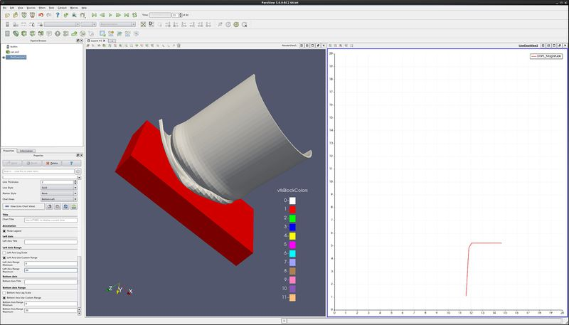
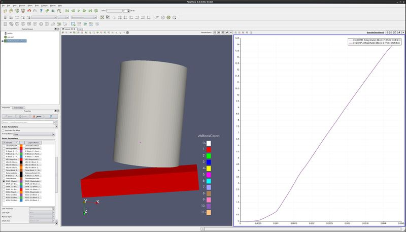
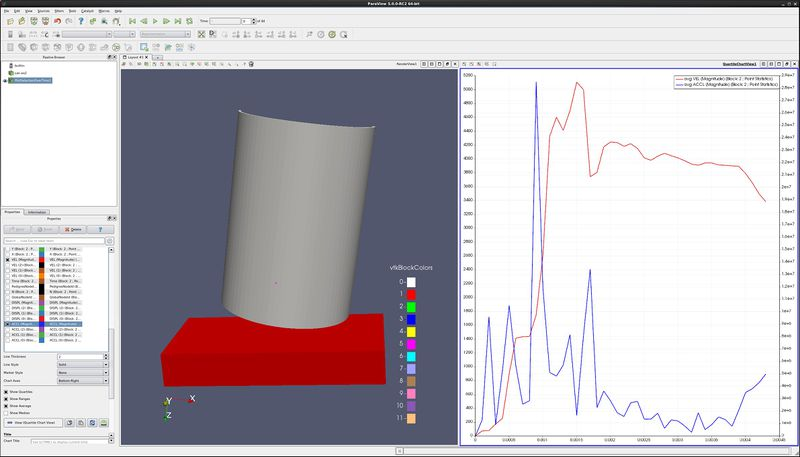
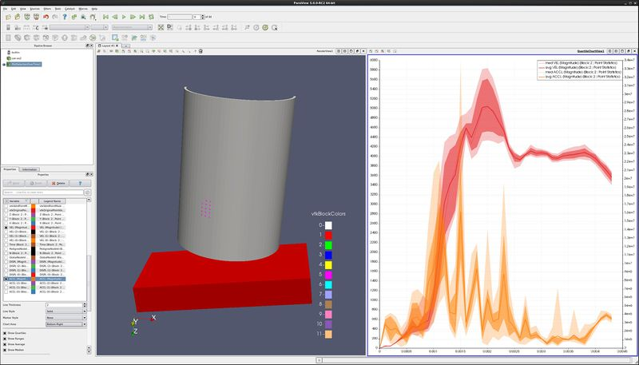
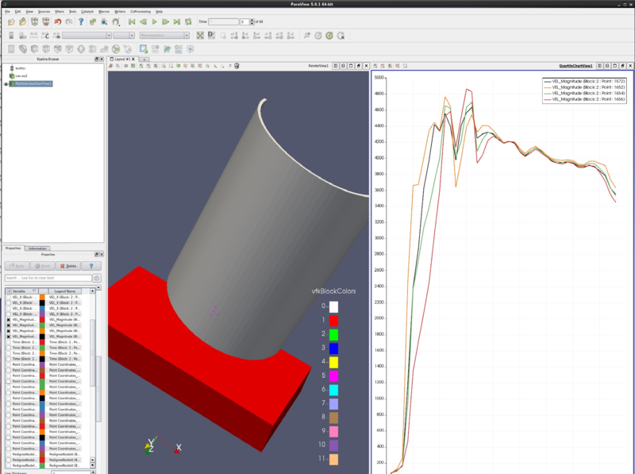
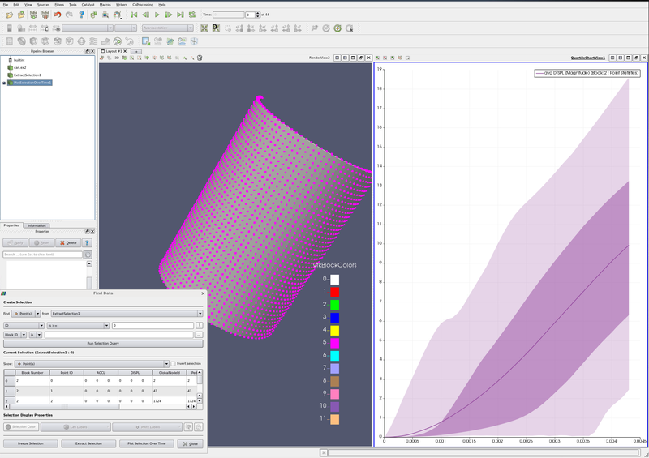
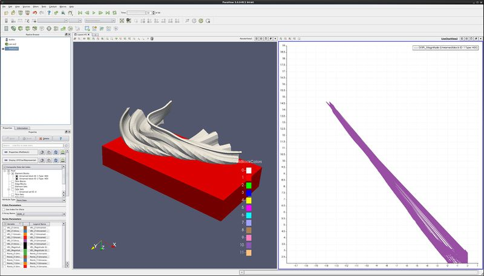

Introduction
============

This use case shows a user how to plot cell and point data. Plotting can
be along a line that cuts through your data, or a location with respect
to time.

Plot along a line
-----------------

-   Open can.exo. Turn on all data. **Apply**.
-   Drag the can around with the left mouse button until you can see the
    can.
-   **Filter→Data Analysis→Plot Over Line**. Drag the top of the line to
    intersect the top of the can. Note that hitting the p key will also
    place the line on the surface of your object. You can also use the
    **1** and **2** keys to set the beginning and end of the line.
    **Apply**.
-   Properties tab. Unselect all variables except **DISPL**:Magnitude.
-   Lower on the Properties tab, find **Left Axis Use Custom Range**.
    Select this, and enter **0.0** and **20.0**.
-   Find **Bottom Axis Use Custom Range**. Select this, and enter
    **0.0** and **20.0**.
-   **Play** the animation forward, and notice what happens to the plot.
-   You can also add plot labels and axis labels on the properties tab.

Plot point over time
--------------------

-   Edit → Reset Session.
-   Open can.exo. Turn on all data. **Apply**.
-   Drag the can around with the left mouse button until you can see the
    can.
-   We want to plot a point over time. First, we need to select a point.
-   Click on **Select Points On** icon. Then, click on a point on the
    can.
-   **Filters→Data Analysis→Plot Point Over Time**. Apply.
-   **Display** tab, unselect everything other than **DISPL
    (Magnitude)**
-   You now have a plot of the displacement. at your point.
-   Extra Credit -- Using **Select Cells On** icon, and the **Plot Cell
    Over Time**, plot **EQPS** over time.

Plot two variables at same time
-------------------------------

-   Follow the steps for **Plot Point over time**, as described above.
-   On the Properties tab, turn off **DISPL (Magnitude)** and turn on
    variables **VEL (Magnitude)** and **ACCL (Magnitude)**.
-   Select the line that says **ACCL (Magnitude)**, causing this row to
    turn gray.
-   At the bottom of the Display tab, change **Chart Axes** to
    **Bottom-Right**.
-   Note below that the ACCL (Magnitude) color has been changed to blue.

Plot multiple points (statistics plot version)
----------------------------------------------

-   **Edit** → **Reset Session**.
-   Open can.exo. Turn on all data. **Apply**.
-   Drag the can around with the left mouse button until you can see the
    can.
-   We want to plot numerous points over time. First, we need to select
    the points.
-   Click on **Select Points On** icon. Then, rubber band select a dozen
    points.
-   **Filters→Data Analysis→Plot Selection Over Time**. Apply.
-   On the Properties tab, turn off all varialbes, and then turn on
    variables **VEL (Magnitude)** and **ACCL (Magnitude)**.
-   Select the line that says **ACCL (Magnitude)**, causing this row to
    turn gray.
-   At the bottom of the Display tab, change **Chart Axes** to
    **Bottom-Right**.

Plot multiple points (spaghetti plot version)
---------------------------------------------

-   **Edit** → **Reset Session**.
-   Open can.exo. Turn on all data. **Apply**.
-   Drag the can around with the left mouse button until you can see the
    can.
-   We want to plot numerous points over time. First, we need to select
    the points.
-   Click on **Select Points On** icon. Then, rubber band select about
    four points.
-   **Filters→Data Analysis→Plot Selection Over Time**. Apply.
-   On the Properties tab, unselect the **Only Report Selection
    Statistics** checkbox. Apply.
-   On the Properties tab, display section, click on **Root**, turning
    on all of the points or cells.
-   On the Properties tab, turn off everything, then turn on all
    variables **VEL (Magnitude)**.

Plot min, max and average for all points of a block over time
-------------------------------------------------------------

-   **Edit** → **Reset Session**.
-   Open can.exo. Turn on all data. **Apply**.
-   Drag the can around with the left mouse button until you can see the
    can.
-   We want to plot all of the can points over time. First, we need to
    select the points.
-   Click on **Select Block** icon. Select the can.
-   **Filters→Data Analysis→Extract Selection**. Apply.
-   We now have the can.
-   **Find Data dialog**. This can be found on the **Edit** menu.
-   Find **Points** from **ExtractSelection\#**.
-   Next line, use **ID** and **is \>=** and **0**.
-   **Run Selection Query**/
-   **Plot Selection Over Time**. Apply.
-   In Series Paramaters, turn off everything except **DISPL
    (Magnitude)**

Plot data
---------

-   **Edit** → **Reset Session**.
-   Open can.exo. Turn on all data. **Apply**.
-   Drag the can around with the left mouse button until you can see the
    can.
-   We want to plot two variables against each other, for all points (or
    cells) of the can.
-   **Filters→Data Analysis→Plot Data**. Apply.
-   On the Properties tab, turn off **Use Index for X Array** and for X
    Array Name select **DISPL\_Z**
-   In Series Paramaters, turn off everything except **DISPL
    (Magnitude)**
-   Play

Acknowledgements
================

Sandia National Laboratories is a multi-mission laboratory managed and
operated by National Technology and Engineering Solutions of Sandia,
LLC., a wholly owned subsidiary of Honeywell International, Inc., for
the U.S. Department of Energy's National Nuclear Security Administration
under contract DE-NA-0003525.
