Introduction
============

ParaView filters

This usecase shows a user how to use sources and filters to modify the
display of data.

Most examples assume that the user starts with a new model. To start
over, go to the menu item **Edit → Reset Session**, and then re-open
your data.

Data is opened by going to **File → Open**. Example data files can be
found on the ParaView web page at <http://www.paraview.org>.

Annotate Time Source
--------------------

-   Open can.exo. Press **Apply**.
-   Drag the can around with the left mouse button until you can see the
    can.
-   Select **Sources → Annotate Time**. **Apply**.
-   Play the animation

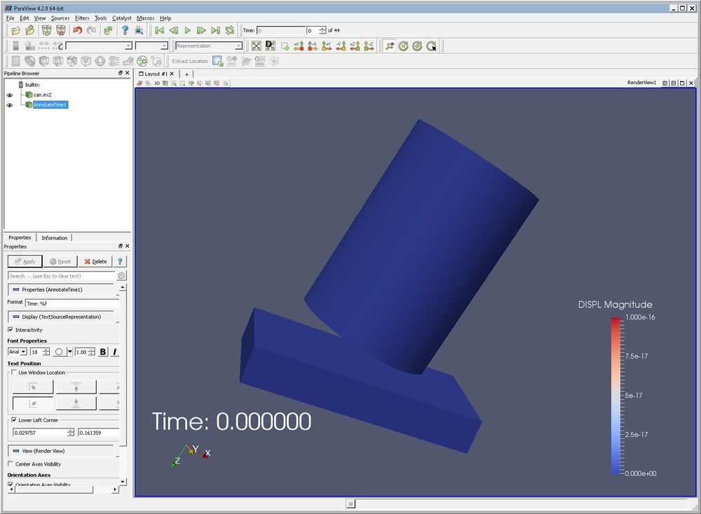

Text Source
-----------

-   This exercise continues on from the previous one. If you are
    starting over, open can.exo. Press **Apply**.
-   Select **Sources → Text**.
-   Type some text in the window.
-   Apply.

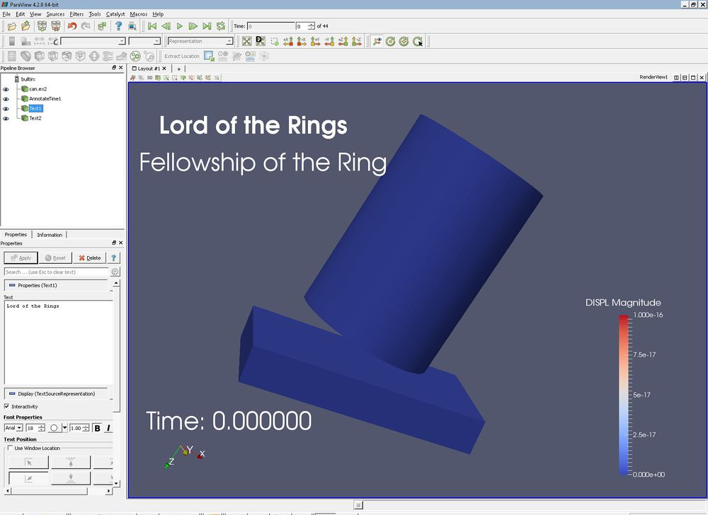

Clip filter
-----------

-   Open can.exo. Press **Apply**.
-   Drag the can around with the left mouse button until you can see the
    can.
-   Select the **Filters → Common → Clip** button. Apply. (Notice that
    this is also the third icon from the top on the far left of the
    screen.)
-   Select the **X Normal** button, **Apply**. Try **Y Normal, Apply**.
-   Grab the arrow control at the end of the clip object with the left
    mouse button. Drag it around and then select **Apply**. You can also
    grab the red box and slide the clip plane forward and backward.
-   Turn off the **Show Plane** checkbox.
-   Select **Inside Out**.
-   If the clip arrow control is ever hidden behind data, you can see it
    by clicking on the "eye" to the left of the "clip" in the **Pipeline
    Browser** which is located in upper left corner of the screen.

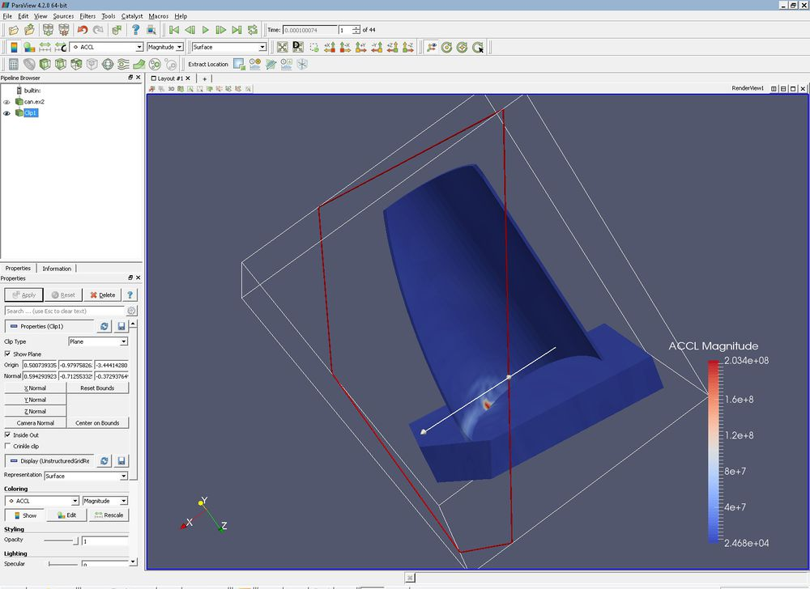

Slice filter
------------

-   Open can.exo. Press **Apply**.
-   Drag the can around with the left mouse button until you can see the
    can.
-   Select the **Filters → Common → Slice** button. **Apply**.
-   Select the **Y Normal, Apply**. Try **Z Normal, Apply**.
-   Grab the arrow control at the end of the clip object with the left
    mouse button. Drag it around and then select **Apply**.
-   Turn off the **Show Plane** checkbox.
-   In the **Slice Offset Value** section, press **New Value**, type
    **1**. **Apply**. Notice that we just added a second cut plane.
-   Under **Slice Offset Values**, press **Delete All**. Select **New
    Range**. Input From value of **-4** and To value of **4**. **OK**.
    **Apply**. Now we have 10 slices through our object.
-   Play the animation.
-   If the slice arrow control is ever hidden behind data, you can see
    it by clicking on the "eye" to the left of the "clip" in the
    Pipeline Browser which is located in upper left corner of the
    screen.

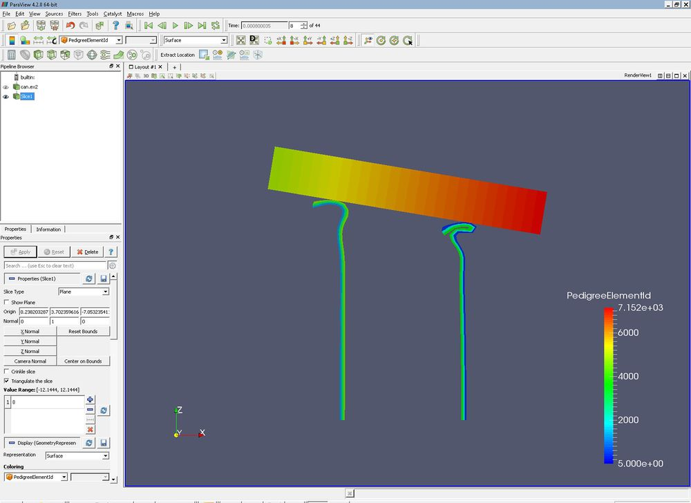

Glyph filter
------------

-   Open can.exo. **Apply**.
-   On the **Properties** tab, click the square to the left of
    "Variables", thus turning all variables on. **Apply**.
-   Drag the can around with the right mouse button until you can see
    the can.
-   Select the*\' Filters → Common → Glyph*\' button. Change the Vectors
    to **ACCL**. **Apply**.
-   ParaView does not set the **Scale Factor** correctly. On the
    **Properties** tab is an entry for **Set Scale Factor**. Change this
    to **1e-7**. **Apply**.
-   Click the **Play** button at the top of the screen. When you are
    done, reset by hitting the **First Frame** button.
-   We want to see the glyphs in context. Turn the visibility eyeball on
    the can.exo to "on". Next, click on can.exo (it will show up as
    blue). Select the **Display** tab. **Style → Representation →
    Wireframe**. **Play** the animation. We can now see where the
    accelerations are occurring as the can is crushed. **Reset** the
    animation.
-   Click on the **Glyph** in the Pipeline Browser, thus giving the
    Glyph focus. In the **Properties** tab, change the **Vectors** to
    **VEL**. Then, change the **Set Scale Factor** to **3e-4**. Be sure
    to then hit the **Apply** button! Re-animate the window.
-   Extra credit -- Change the color of the glyphs to match the picture
    below.

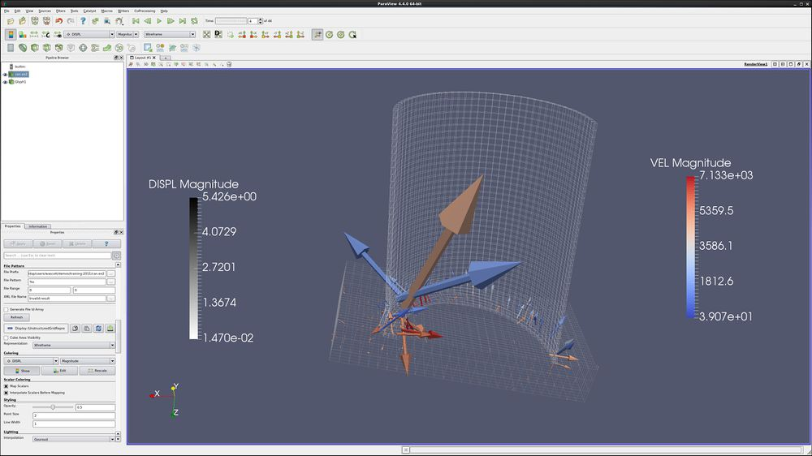

Threshold filter
----------------

-   Open disk\_out\_ref.exo.
-   On the **Properties** tab, click the square to the left of
    "Variables", thus turning all variables on. **Apply**.

Spin the object around, and look inside of it.

-   Select the **Threshold** button , found to the far left. (Notice
    that you can also find this through the filters menu.) Select
    **Scalars** "Temp" (Temperature). The blue recycle button will set
    the min and max values.
-   Change the **Lower Threshold** to 400. **Apply**.
-   **Color by**: **Pres**.
-   Spin the object around, and look at it.
-   Now, let's place this hot section back into the cylinder. Let's open
    another version of disk\_out\_ref.exo, using the **File → Open**
    menu. Once again, turn all node variables on. **Apply**.
-   Make sure that the second disk\_out\_ref.exo is highlighted in the
    Pipeline Browser, and set **Representation** to **Wireframe**.
-   Still on the **Display** tab, select **Color by**: **Pres**
-   What we have done: We have created an an unstructured grid holding
    the cells that fit our criteria. This can make our data much bigger,
    and should be avoided if we are working with big data.

<!-- -->

-   Extra credit -- Change the outside cylinder to be volume rendered,
    under the **Display** Tab **Style → Representation**: set to
    **Volume**.

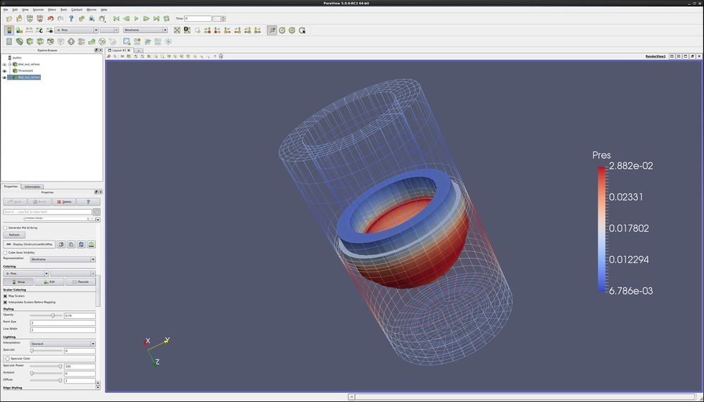

Contour filter
--------------

-   Open disk\_out\_ref.exo.
-   On the **Properties** tab, click the square to the left of
    "Variables", thus turning all variables on. **Apply**.
-   Select **Filters → Common → Contour**. Change **Properties**:
    **Contour By**: to **Temp**. Under **Value Range**, press **Delete
    All**, now press **New Value**, enter **400**. **Apply**.
-   **Color by: Temp**.
-   Why are all parts of the object the same color?
-   **Color by: Pres** (Pressure).
-   This represents the location inside of the cylinder that is at
    temperature 400, and is colored by pressure.
-   Turn the visibility back on for the disk\_out\_ref.exo.
-   Highlighting the disk\_out\_ref.exo (turning it white), select
    **Representation Wireframe**.
-   **Color by**: Point **Pres**.
-   Notice that this is another way to see two representations of the
    same object by reading the object in once and modifying it. In the
    Threshold Filter (above), we read in the object twice, and displayed
    each object differently.

<!-- -->

-   What we have done: We have created an isosurface of a specific
    temperature. One nice thing about isosurfaces is that they decrease
    the amount of data that has to fit into memory. This is handy when
    you are displaying big data.

<!-- -->

-   Extra credit -- Highlight disk\_out\_ref.exo, and select a **clip**
    filter. Select **X Normal** for the clip plane. Why has the
    disk\_out\_ref.exo model now turned solid? (Hint -- the visibility
    has changed)
-   More extra credit -- Under **contour**, delete the Isosurface, and
    use **New Range** to create 10 new surfaces. Next, use a **clip**
    filter to cut the cylinder in half. What are the surfaces showing
    us? What are the colors showing us? Last, after highlighting clip,
    under **Properties** tab, change the **Opacity** to **.50**.

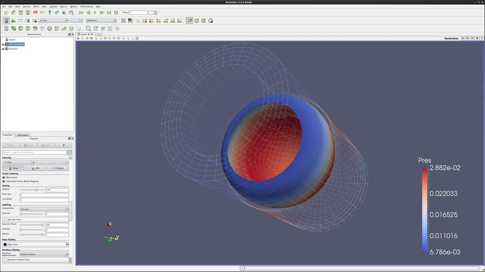

Clip to Scalar filter
---------------------

-   Open disk\_out\_ref.exo.
-   On the **Properties** tab, click the square to the left of
    "Variables", thus turning all variables on. **Apply**.
-   Select the **Filters →Recent →Clip** button. **Accept**.
-   Select **Clip Type → Scalar**.
-   Select **Scalars → Temp**.
-   Input a **Value** of **400**. **Apply**.
-   Select filter **Clip** again. Unclick **Show Plane**. **Apply**.
-   **Color by temp**.
-   Highlight disk\_out\_ref.exo, turn the eyeball on, display by
    **Volume**, and color by **Temp**.

What we have done: We have clipped to a constant scalar, creating a
smooth mesh. Once again, this increases the size of your data
significantly.

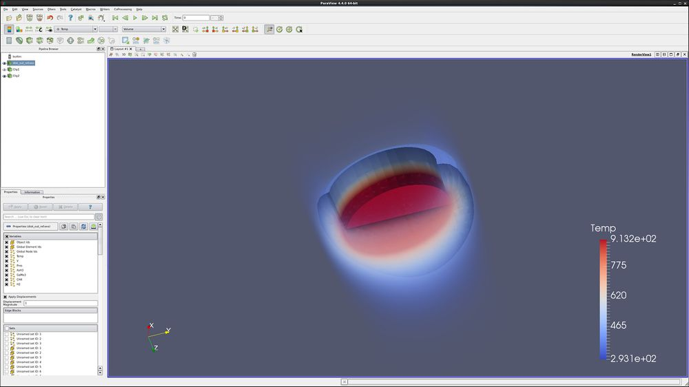

Cell to Point/ Point to Cell filters
------------------------------------

These filters are used to convert a data set from being cell data to
being point data and vice versa. This is sometimes useful if a filter
requires one type of data, and a user only has the other type of data.
An example would be using can.exo. You cannot get a contour of EQPS
directly, since EQPS is cell data and contour only works on points. Use
filter Cell Data to Point Data first, then call contour.

Stream Tracer
-------------

-   Open disk\_out\_ref.exo.
-   On the **Properties** tab, click the square to the left of
    "Variables", thus turning all variables on. **Apply**.
-   Select the **Filters → Common → Stream Tracer** button.
-   Click the **Seeds: Center on Bounds** button, **Apply**..
-   Under the **Display** tab, **Color by Temp**, then **V**, then
    **Pres**.
-   If necessary, click **Color, Reset Range**.
-   Extra credit -- On the **Properties** page, set the **Number of
    Points** to **40**. **Apply**. Add a Tube filter, **Filters →
    Alphabetical → Tube**. **Apply**.

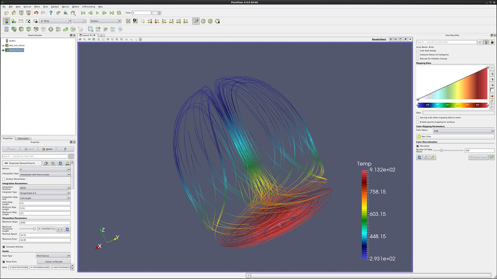

Calculator filter
-----------------

-   Open disk\_out\_ref.exo.
-   On the **Properties** tab, click the square to the left of
    "Variables", thus turning all variables on. **Apply**.
-   Select the **Filters → Common → Calculator** button.
-   Select **Attribute Mode**: **Cell Data**.
-   **Result Array Name**: set to **RandomNumber**.
-   In the empty line below, type
    **cos(GlobalElementId)\*sin(GlobalElementId)**. Notice that you can
    pull in the names of the variables by clicking on the **Scalars**
    button.
-   Set the **Display** tab, Color → **Color by** to **RandomNumber**.
-   We are now coloring by a pseudo random number. This shows how
    complex our data is.

<!-- -->

-   Note that you can create a vector from three scalars using the
    calculator. For instance, to create an X,Y,0 vector from Velocity,
    enter the following:
    -   **VEL\_X\*iHat+VEL\_Y\*jHat+0\*kHat**
-   To get the length of a vector, use **mag(vector\_name)**. To get the
    length of a vector squared, use
    **mag(vector\_name)\*mag(vector\_name)**.

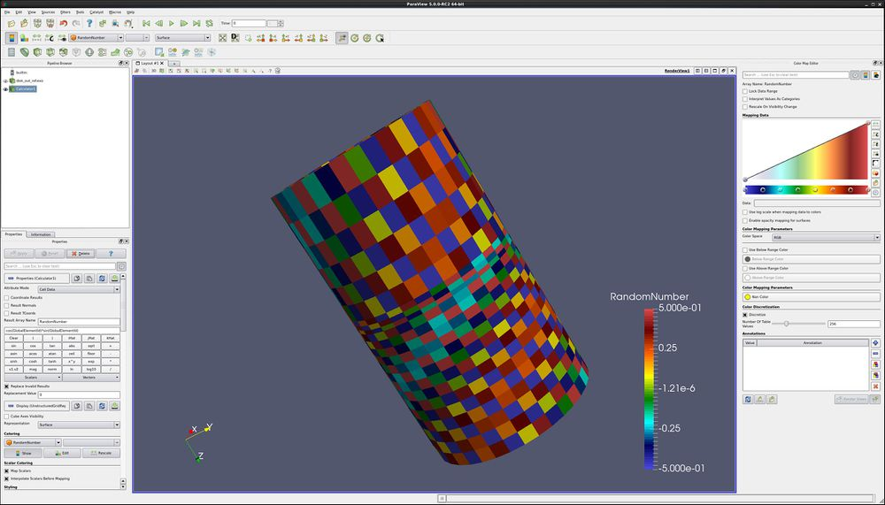

Favorites
---------

ParaView allows users to place their favorite filters into the submenu
named **Filters → Favorites**. Just use the Manage Favorites tool.

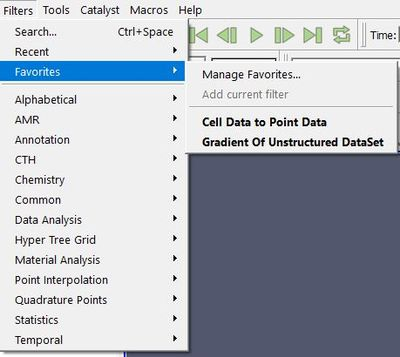

Customize Shortcuts
-------------------

ParaView allows users to add keyboard shortcuts to your favorite menu or
filter. This is found under **Tools → Customize Shortcuts**.

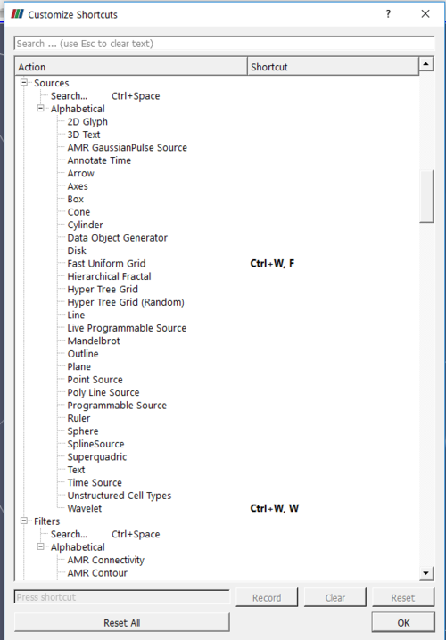

Acknowledgements
================

Sandia National Laboratories is a multi-mission laboratory managed and
operated by National Technology and Engineering Solutions of Sandia,
LLC., a wholly owned subsidiary of Honeywell International, Inc., for
the U.S. Department of Energy's National Nuclear Security Administration
under contract DE-NA-0003525.
