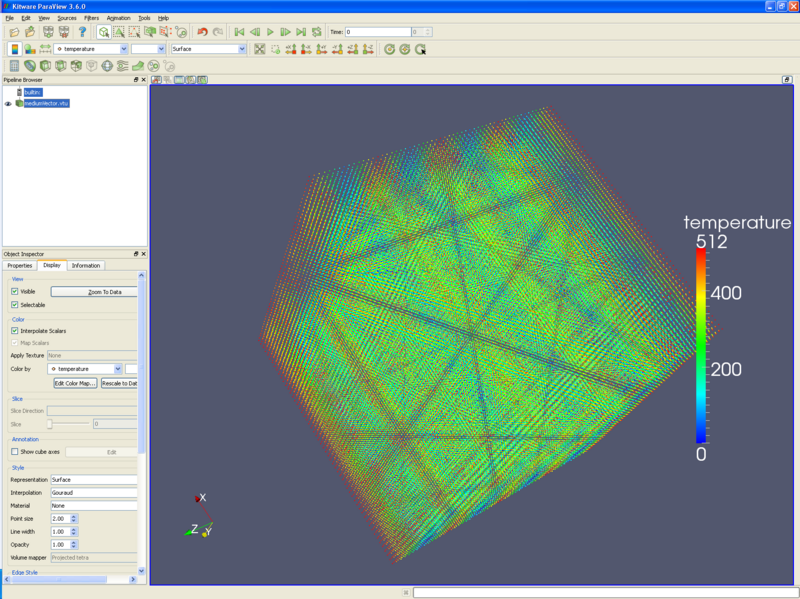
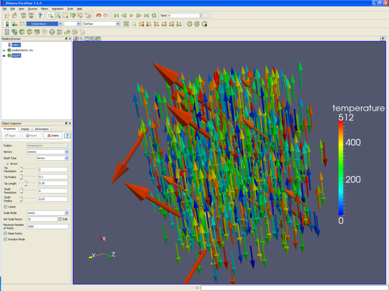
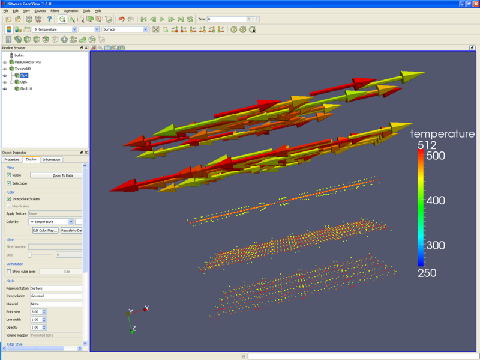
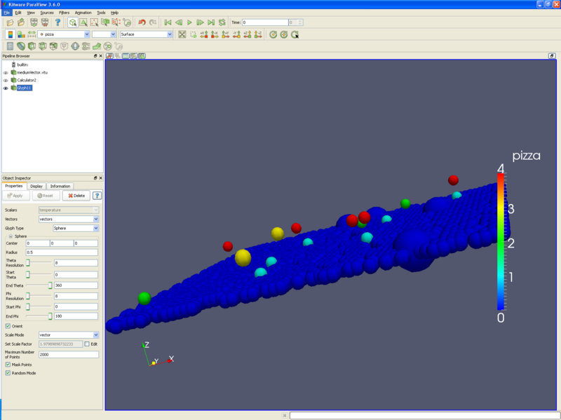

Introduction
============

Particle simulations consist of point data, rather than cell or element
data. An example may be electrons in a field, or water molecules in a
fluid. Particle datasets can be combined with other datasets to show
particle motion in a solid or liquid.

This tutorial uses a dataset named mediumVector.vtu. I will try to get
it on the Kitware web site. If you want to make it yourself, it is just
a vtk dataset, using the format listed at the end of this tutorial. I
then read it into ParaView, and used the reflect filter in the X, then
Y, then Z direction. I believe I then did the same reflections again.
Finally, this file was written out to disk as a .vtu file.

Displaying particles
====================

-   Open ParaView, and read in your dataset.
-   If you are running ParaView 3.6.0 or 3.4.0, you will want to reset
    the point sizes. **Display tab/ Style/ Point size** 2 (or 1,
    depending on your preference). The following picture holds about
    250,000 points.



Glyphing particles
==================

-   You may want to replace these particles with spheres or arrows,
    using the glyph filter. The glyph filter will depopulate your
    dataset to a reasonable number of items, and this reasonable number
    is set by the **Maximum number of points** input box. **Random
    mode** often creates better looking output, but is not useful if you
    animate through numerous time steps. The following picture has
    arrows for particles, using vectors for direction and length, and
    colored by temperature.



Thresholding particles
======================

-   Another filter that is useful is the **threshold filter**. Using the
    **threshold filter**, a user can select only those particles that
    are of interest. For instance, the following picture only displays
    particles that have a temperature of 430 to 511 degrees. Using the
    **clip filter**, the upper half of the picture has arrow glyphs, and
    the lower half has the particles themselves - all colored by
    temperature.



Scatter Plot
============

-   Finally, you can make a scatter plot through the **calculator
    filter**. For instance, if we want to preserve the X and Y
    coordinates of our points, but use number of pizzas for the Z
    component, we would do the following:
    -   Open the **calculator filter**.
    -   Check the **Coordinate Results** check box.
    -   Input the formula **coordsX\*iHat+coordsY\*jHat+pizza\*kHat**.
        This creates a vector, as follows: (X,Y,pizzas). (Think of the
        iHat as \"This is an X\", the \* as tying the coordinates and
        variables together, and the + sign as the comma between X,Y, and
        Z.)



Example data file
=================

This data is written to a .vtk file. Note that I have deleted a lot of
the data, which will need to be recreated. Also note that I added some
random variable data - for instance, some locations have 1 or 2 pizzas.
This actually creates a strange dataset - with many points per cell, but
it worked for display purposes.

``` {.text}
# vtk DataFile Version 2.0
Unstructured Grid Example
ASCII

DATASET UNSTRUCTURED_GRID
POINTS 512 float
0 0 0  1 0 0  2 0 0  3 0 0  4 0 0  5 0 0  6 0 0  7 0 0
0 1 0  1 1 0  2 1 0  3 1 0  4 1 0  5 1 0  6 1 0  7 1 0
...
0 0 1  1 0 1  2 0 1  3 0 1  4 0 1  5 0 1  6 0 1  7 0 1
0 1 1  1 1 1  2 1 1  3 1 1  4 1 1  5 1 1  6 1 1  7 1 1
...
0 0 2  1 0 2  2 0 2  3 0 2  4 0 2  5 0 2  6 0 2  7 0 2
0 1 2  1 1 2  2 1 2  3 1 2  4 1 2  5 1 2  6 1 2  7 1 2
...
CELL_TYPES 52
1
1
...
POINT_DATA 512
SCALARS temperature float 1
LOOKUP_TABLE default
000.0 001.0 002.0 003.0 004.0 005.0 006.0 007.0 008.0 009.0
010.0 011.0 012.0 013.0 014.0 015.0 016.0 017.0 018.0 019.0
...
SCALARS pizza float 1
LOOKUP_TABLE default
000.0 000.0 000.0 000.0 000.0 000.0 000.0 000.0 000.0 000.0
000.0 000.0 000.0 000.0 000.0 000.0 000.0 000.0 000.0 000.0
...
VECTORS vectors float
1 0 0  1 0 0  1 0 0  1 0 0  1 0 0  1 0 0  1 0 0  1 0 0  1 0 0  1 0 0
1 0 0  1 0 0  1 0 0  1 0 0  1 0 0  1 0 0  1 0 0  1 0 0  1 0 0  1 0 0
...
```

Acknowledgements
================

Sandia National Laboratories is a multi-mission laboratory managed and
operated by National Technology and Engineering Solutions of Sandia,
LLC., a wholly owned subsidiary of Honeywell International, Inc., for
the U.S. Department of Energy's National Nuclear Security Administration
under contract DE-NA-0003525.
