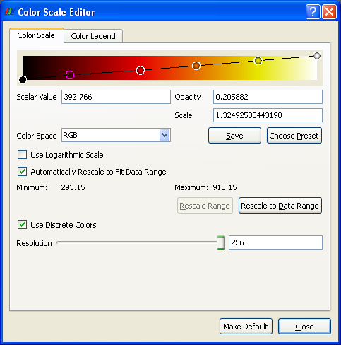
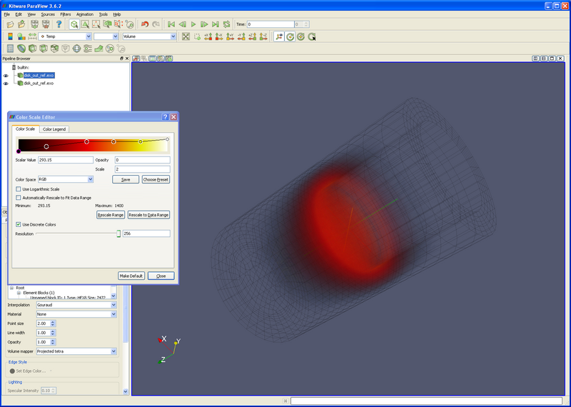

Introduction
============

Fire is visualized using ParaView\'s volume rendering functionality.
Unfortunately fire simulations are extremely large. Fortunately, we can
use disk\_out\_ref.exo as a substitute dataset.

Note: Volume rendering is very resource intensive. It is possible to
display a dataset using surface that chokes using Volume Rendering. The
solution is to grab more nodes of your cluster (thus picking up more
memory).

Note: Currently (3.6.2 and 3.8.0), volume rendering only works on one
block at a time. Thus, before volume rendering multiple blocks, run the
\"Merge Block\" filter. This should be fixed in a future version of
ParaView.

Note: Hitting the <CR> key will close this window, which is not expected
behavior.

-   Start ParaView
-   Open disk\_out\_ref.exo. Select all variables. Apply.
-   Color by temperature.
-   Representation by Volume Rendering.

Since this tutorial is for rendering fire, we need to make
disk\_out\_ref.exo look like fire.

-   Edit Color Map
-   Choose Preset. Choose Black-Body Radiation. OK.
-   Add a point on the color scale in the orange area, and another at
    the top of the black. See the Color Scale Editor below.
    -   You can create a point on the color scale by clicking in the
        window.
    -   You can select a point on the color scale by clicking on it.
    -   You can move between points using the Tab and <SHFT>-Tab keys.
    -   You can delete points using the delete key.

We now need to set the temperature, opacity and scale.

-   The temperature should be set by the physical laws of a black body
    curve. Thus, set the 6 points as follows, starting from the left:
    -   Point 0 - Cold air - Scalar Value = 300
    -   Point 1 - Soot - Scalar Value = 500
    -   Point 2 - Red glow - Scalar Value = 800
    -   Point 3 - Orange glow - Scalar Value = 1000
    -   Point 4 - Yellow hot - Scalar Value = 1200
    -   Point 5 - White hot - Scalar Value = 1500

<!-- -->

-   The Opacity requires a bit of artistic license. What we are trying
    to do is show the different temperatures inside of the flame. Also,
    we may want to show differing amounts of soot - which will be point
    number1. Thus, a user needs to play with these capacities to get
    desired results. Starting from the left:
    -   Point 0 - Cold air - Opacity = 0 - This represents cool air that
        does not have a color.
    -   Point 1 - Soot - Opacity = 0.2-0.5 - This represents soot.
    -   Point 2 - Red glow - Opacity = 0.4-1.0 - This represents the air
        as it is starting to glow.
    -   Point 3 - Orange glow - Opacity = 0.6-1.0 - The air is getting
        hotter again.
    -   Point 4 - Yellow hot - Opacity = 0.8-1.0 - Yellow hot.
    -   Point 5 - White hot - Opacity = 1.0 - White. We want this to be
        totally opaque.

Last, the user will want to play with the Scale. This will change
between datasets. Start with 5, and move up and/or down.

Acknowledgements
================

Sandia National Laboratories is a multi-mission laboratory managed and
operated by National Technology and Engineering Solutions of Sandia,
LLC., a wholly owned subsidiary of Honeywell International, Inc., for
the U.S. Department of Energy's National Nuclear Security Administration
under contract DE-NA-0003525.
